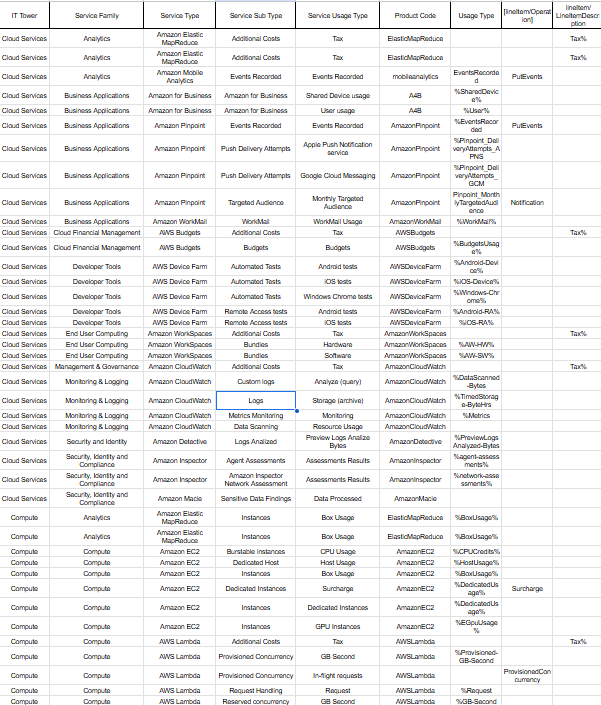

# Отчет по облачной лабораторной работе AWS, Вариант 4

`Цель работы`: Знакомство с облачными сервисами. Понимание уровней абстракции над инфраструктурой в облаке. Формирование понимания типов потребления сервисов в сервисной-модели.

`Дано`: 
* Слепок данных биллинга от провайдера после небольшой обработки в виде SQL-параметров. Символ % в начале/конце означает, что перед/после него может стоять любой набор символов.
* Образец итогового соответствия, что желательно получить в конце. В этом же документе 

`Необходимо`:
* Импортировать файл .csv в Excel или любую другую программу работы с таблицами. Для Excel делается на вкладке Данные – Из текстового / csv файла – выбрать файл, разделитель – точка с запятой.
* Распределить потребление сервисов по иерархии, чтобы можно было провести анализ от большего к меньшему (напр. От всех вычислительных ресурсов Compute дойти до конкретного типа использования - Выделенной стойка в датацентре Dedicated host usage).
* Сохранить файл и залить в соответствующую папку на Google Drive.

`Алгоритм работы`: Сопоставить входящие данные от провайдера с его же документацией. Написать в соответствие колонкам справа значения 5 колонок слева, которые бы однозначно классифицировали тип сервиса. Для столбцов IT Tower и Service Family значения можно выбрать из образца.

Скриншот начальной таблицы:

## Описание сервисов:
1. __ElasticMapReduce__ - Предназначен для обработки и анализа больших объемов данных с помощью фреймворков Hadoop, Spark, Hive, и Presto.
2. __mobileanalytics__ - Служба аналитики мобильных приложений.
3. __A4B__ - Услуги для бизнеса, такие как Amazon Chime или устройства Amazon Echo для профессионального использования.
4. __AmazonPinpoint__ - Платформа для взаимодействия с клиентами через электронную почту, SMS, push-уведомления и другие каналы.
5. __AmazonWorkMail__ - Управляемая корпоративная почтовая служба.
6. __WSBudgets__ - Управление затратами на AWS.
7. __AWSDeviceFarm__ - Инструмент для тестирования и автоматизации тестирования мобильных и веб-приложений.
8. __AmazonWorkSpaces__ - Управляемая служба виртуальных рабочих мест.
9. __AmazonCloudWatch__ - Мониторинг и управление ресурсами AWS. Сбор метрик, журналов и событий, а также настройка автоматических действий в ответ на изменения состояния.
10. __AmazonDetective__ - Инструмент для расследования угроз в AWS.
11. __AmazonInspector__ - Оценка безопасности приложений в AWS.
12. __AmazonMacie__ - Обнаружение и защита чувствительных, конфиденциальных данных.
13. __AmazonEC2__ - Основной сервис вычислительных ресурсов в AWS. Аренда VPS.
14. __AWSLambda__ - Безсерверная вычислительная платформа. Позволяет запускать код в ответ на события без управления серверами, сокращая операционные затраты.

## Выполненная работа

Скриншот итоговой таблицы

Таблица доступна по [ссылке](https://docs.google.com/spreadsheets/d/1NUMh95uMoYrvo4t5XIa98bRV87YlU21ttNtmSrWyHws/edit?gid=0#gid=0)

## Выводы

Во время выполнения облачной лабораторной работы AWS, мне удалось достичь всех поставленных целей. Я познакомился с различными облачными сервисами и лучше понял, как устроена инфраструктура AWS.

Классифицируя сервисы по документации и сопоставляя их с данными биллинга, я смог разобраться, как именно используются разные сервисные модели. Это помогает лучше управлять затратами и эффективнее использовать облачные ресурсы.