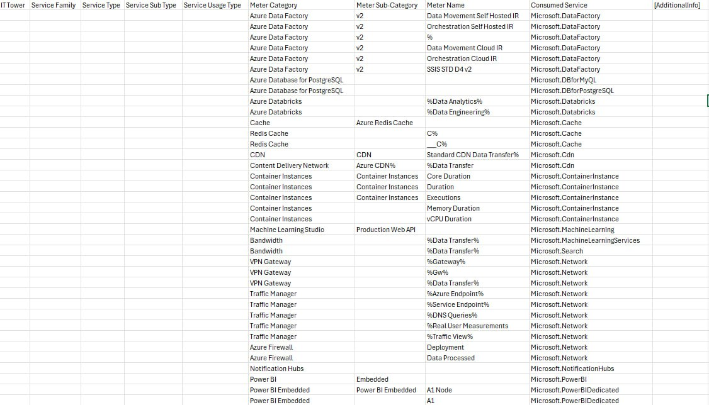
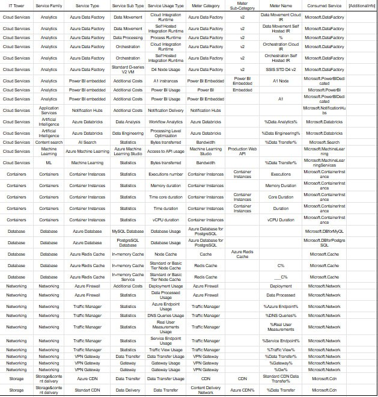

# Отчет по облачной лабораторной работе Azure, Вариант 4

`Цель работы`: Получение навыков аналитики и понимания спектра публичных облачных сервисов без привязки к вендору. Формирование у студентов комплексного видения Облака. 

`Дано`: 
* Данные лабораторной работы 1.
* Слепок данных биллинга от провайдера после небольшой обработки в виде SQL-параметров. Символ % в начале/конце означает, что перед/после него может стоять любой набор символов.
* Образец итогового соответствия, что желательно получить в конце. В этом же документе  

`Необходимо`: 
* Импортировать файл .csv в Excel или любую другую программу работы с таблицами. Для Excel делается на вкладке Данные – Из текстового / csv файла – выбрать файл, разделитель – точка с запятой.
* Распределить потребление сервисов по иерархии, чтобы можно было провести анализ от большего к меньшему (напр. От всех вычислительных ресурсов Compute дойти до конкретного типа использования - Выделенной стойка в датацентре Dedicated host usage). При этом сохранять логическую концепцию, выработанную в Лабораторной работе 1.
* Сохранить файл и залить в соответствующую папку на Google Drive.

`Алгоритм работы`: Сопоставить входящие данные от провайдера с его же документацией. Написать в соответствие колонкам справа значения 5 колонок слева, которые бы однозначно классифицировали тип сервиса. Для столбцов IT Tower и Service Family значения можно выбрать из образца. В ходе выполнения работы не отходить от принципов классификации, выбранных в Лабораторной работе 1. Например, если сервис Машинного обучения был разбит на Вычислительные мощности и Облачные сервисы, то продолжать его разбивать и в новых данных.

Скриншот начальной таблицы:

## Описание сервисов:
1. __Azure Data Factory__ - Платформа интеграции данных для автоматизации процессов извлечения, трансформации и загрузки.
2. __Power BI Embedded__ - Предоставляет возможность интеграции аналитики и визуализации Power BI в приложения и веб-ресурсы.
3. __Notification Hubs__ - Платформа для управления push-уведомлениями.
4. __Azure Databricks__ - Используется для обработки данных на основе Apache Spark и построения моделей машинного обучения.
5. __Bandwidth__ - Услуги пропускной способности. Сюда входит стоимость передачи данных между сервисами и за пределы Azure.
6. __Machine Learning Studio__ - Платформа для разработки моделей машинного обучения.
7. __Container Instances__ - Легкий запуск контейнеров в облаке.
8. __Azure Database for PostgreSQL__ - Управляемая база данных PostgreSQL.
9. __Cache__ - Кэширование данных для ускорения приложений.
10. __Redis Cache__ - Расширенная версия кэширования на базе Redis.
11. __Azure Firewall__ - Обеспечивает фильтрацию трафика и защиту ресурсов Azure от угроз.
12. __Traffic Manager__ - Оптимизирует маршрутизацию трафика для приложений, работающих в глобальном масштабе.
13. __VPN Gateway__ - Создание и управление VPN в облаке.
14. __CDN (Content Delivery Network)__ - Сеть доставки контента. Ускоряет доставку контента пользователям по всему миру через глобальную сеть серверов.

## Выполненная работа

Скриншот итоговой таблицы

Таблица доступна по [ссылке](https://docs.google.com/spreadsheets/d/1yq3mkqXfD9MQ8ZrugCUW0QmaGcJlWgyCa3WvoNnsuJo/edit?gid=0#gid=0)
