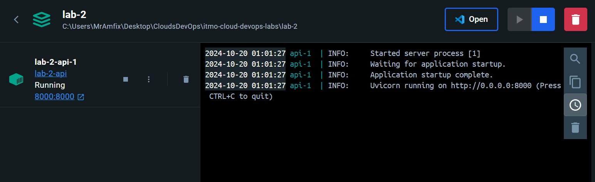
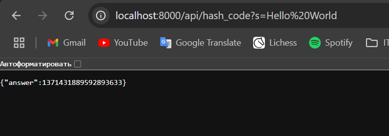
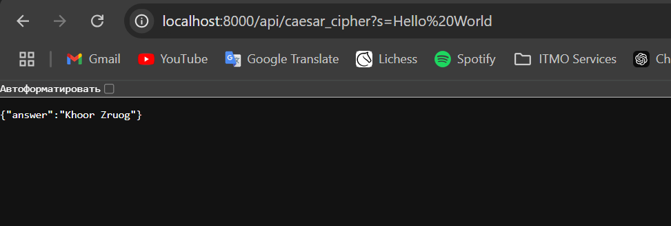

# Отчет по лабораторной работе №2

## Описание плохих практик (BadDockerfile)
* Используется ```FROM python:latest```. Так не стоит делать, так как может например выйти новая версия, в которой будет куча багов и ваше приложение может не работать с этой версией.
* Используется ```copy . .```. Тут аж сразу две плохих практики. Мы копируем все файлы (в том числе ненужные) и прямо в корневую директорию.
* Бонус: ```RUN pip install -r /requirements.txt``` не является особо плохой практикой, но можно улучшить.

## Накосячили, теперь исправляем (GoodDockerfile)
* ```FROM python:3.12-bookworm```. Указываем конкретный образ, наше приложение теперь не сломается при обновлении образа.
* ```WORKDIR /app```, ```COPY requirements.txt simple_api.py /app/```. Создаем рабочую директорию, копируем только нужные файлы. Уменьшаем вес и не работаем в корне (работа в корне может привести к нежелательным последствиям).
* Бонус: ```RUN pip install --no-cache-dir -r requirements.txt```. Не сохраняем временные файлы, что уменьшает вес контейнера.

## И наконец, как не стоит работать с контейнерами
* Не стоит запускать контейнер с правами ```root```, особенно если вы запускаете его на арендованном сервере. Злоумышленники могут получить доступ к системе и благодаря root-правам, например, украсть информацию.
* Не стоит хранить в контейнеры данные, например внутри системы. При пересборке контейнера они просто исчезнут.

## Как я делал лабораторную работу
Для начала написал ```simple_api.py```. После чего начал вспоминать мой опыт работы с докером. К счастью я вспомнил, как набивал шишки.
Сам в первый раз писал ```FROM python:lastest```. Ну и в целом вспомнить плохие практики было не трудно, ибо сам совершал эти ошибки и исправлял их.

## [Какие ваши доказательства?](https://www.youtube.com/watch?v=rbsKcreUw9M)
Надеюсь вы кликнули :D

Я запустил GoodDockerfile, скриншот, что он работает:



И послал 2 запроса на api:
1) ```http://localhost:8000/api/hash_code?s=Hello%20World```
2) ```http://localhost:8000/api/caesar_cipher?s=Hello%World```




