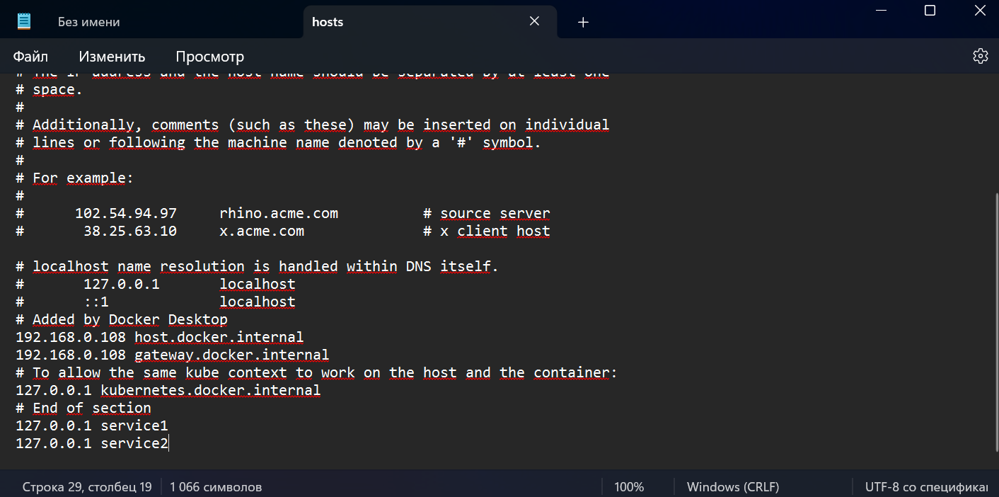
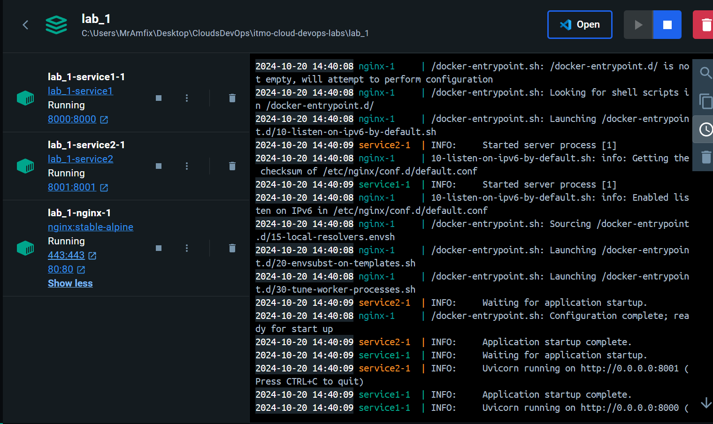
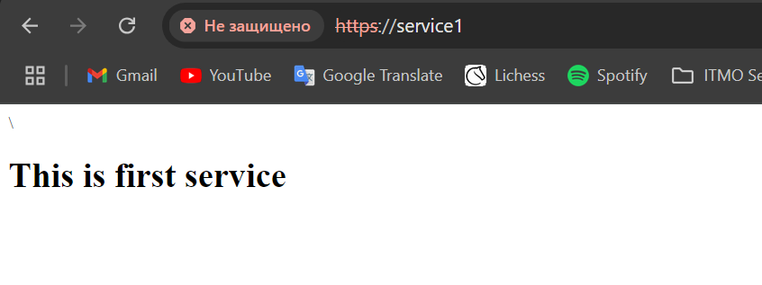
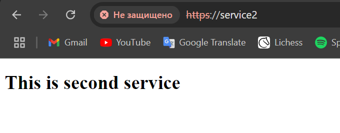
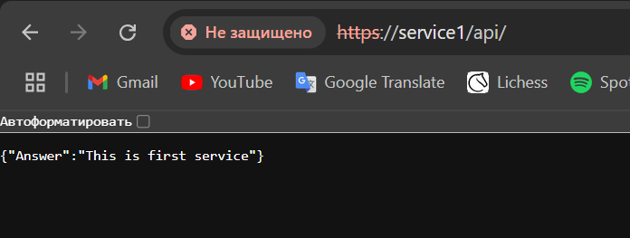
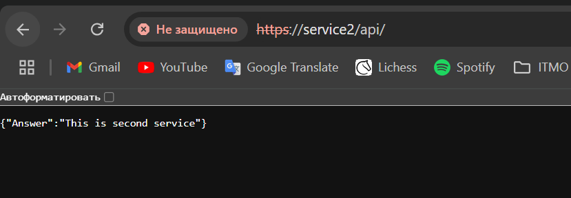

# Отчет по лабораторной работе №1

## Как шла работа

Для начала я добавил ```service1``` и ```service2``` в ```hosts```, чтобы nginx знал куда ему обращаться, а не думал что это за буковки в ```server_name```.



После с помощью ```openssl``` сгенерировал [```SERT_NAME.crt```](./nginx/SERT_NAME.crt) и [```SERT_NAME.key```](./nginx/SERT_NAME.key).

Далее я написал [```nginx.conf```](./nginx/nginx.conf) c двумя сервисами и для каждого настроил переадресацию с ```http``` на ```https```.

```
server {
    listen 80;
    server_name service1 service2;
    return 301 https://$host$request_uri;
}
```

Для каждого сервиса были написаны index.html и простенькая api на Python.

В конце я написал [```docker-compose.yml```](./docker-compose.yml), который поднимет три контейнера: 2 с api и одни с nginx и запустил его.



[__Мой пк после запуска трех контейнеров__](https://www.youtube.com/watch?v=i08Q0bzxiuA)

## И скриншоты, что все работает

* Делаем запрос ```http://service1```, нас перекидывают на ```https://service1``` и мы видим такую картинку:

* Так же ```http://service2``` -> ```https://service2```

* И с api ```http://service1/api``` -> ```https://service1/api```

* ```http://service2/api``` -> ```https://service2/api```
