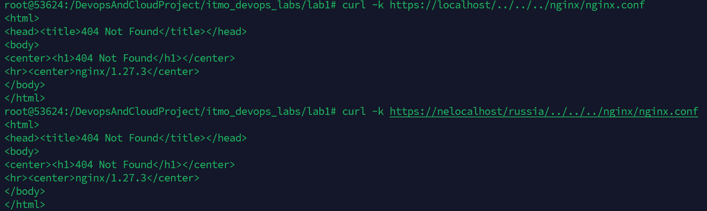
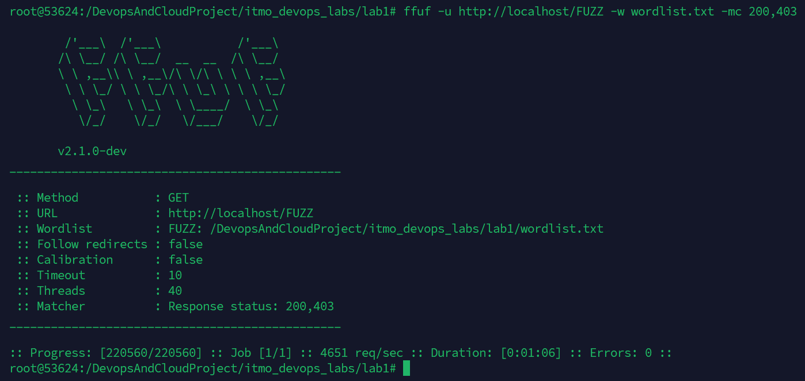
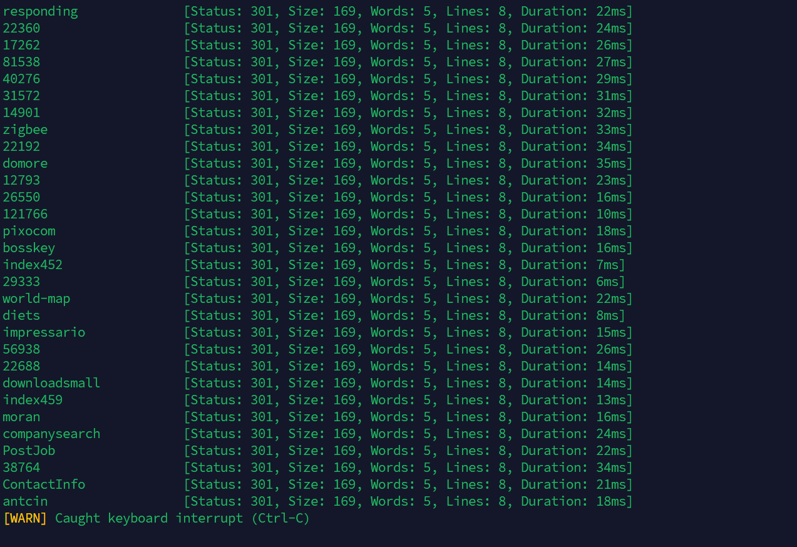
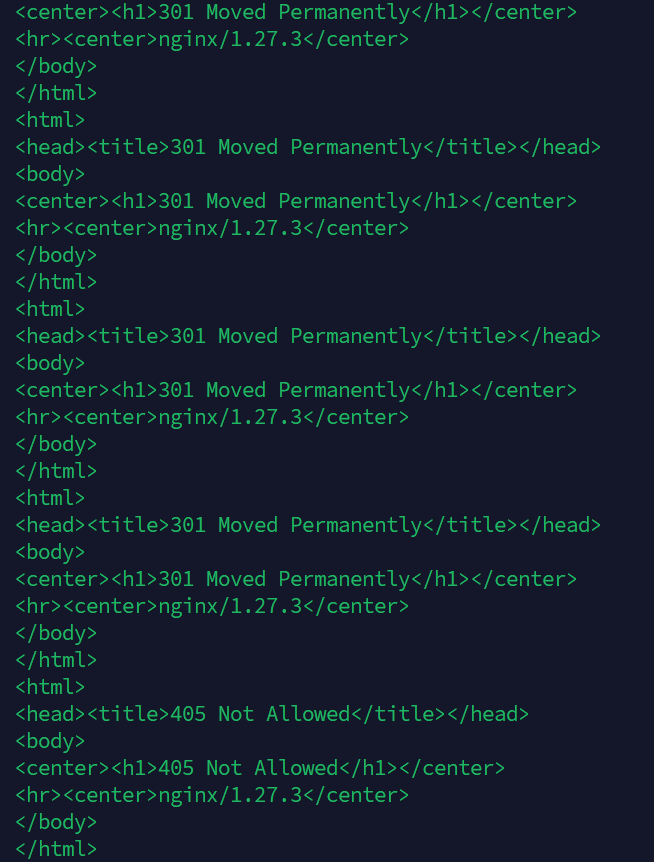

# Отчет по лабораторной работе №1*

Мы с командой [TEX](https://github.com/Namil27/itmo_devops_labs/tree/main/lab1) договорились выполнять лабораторную работу вместе и попытаться взломать nginx у друг друга.

Приступаем к выполнению, клонируем репозиторий и поднимаем их проект.
## 1. Path Traversal
Пробуем\
```curl -k https://localhost/../../../nginx/nginx.conf``` \
```curl -k https://nelocalhost/russia/../../../nginx/nginx.conf```

Получаем 404 Not Found. Запрос не сработал так как конфигурация try_files в Nginx явно запрещает доступ к файлам, которых нет в пределах указанного root (например, /pet1 или /pet2).

## 2. FFUF & Brute Force
Воспользовался\
```ffuf -u http://localhost/FUZZ -w wordlist.txt```\
Но так как я скачал слишком большой wordlist сервер начал виснуть, пришлось прервать и запустить\
```ffuf -u http://localhost/FUZZ -w wordlist.txt -mc 200,403```

Никаких директорий найдено не было, с кодом 301 я решил не запускать, хоть это и редирект, но все записи идут со статусом 301 и по итогу в консоль выводились все 200к+ записей из wordlist, что равносильно смерти.


## 3. HTTP Verb Tampering
Попробуем поспамить запросами с разными заголовками в поисках незащищенных методов\
```
curl -X GET http://localhost/russia 
curl -X POST http://localhost/russia -d "data=test" 
curl -X PUT http://localhost/russia -d "data=test" 
curl -X DELETE http://localhost/russia 
curl -X OPTIONS http://localhost/russia 
curl -X PATCH http://localhost/russia -d "data=test" 
curl -X TRACE http://localhost/russia 
```


Как видно на большинство запросов было возвращено 301, только на TRACE 405

## Выводы
Так как весь проект по сути - 2 картинки на localhost и nelocalhost, то особо тут не разгуляешься, даже sql-инъекции не поделаешь, но так лабораторная работа интересная. Узнал как могут атаковать мои проекты и поразмышлял над тем как можно защитить их.
