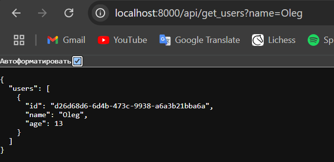

# Отчет по лабораторной работе №2*

## Плохие практики (bad_docker-compose.yml)
* Использование ```image: postgres:latest```. Такая же ошибка, как в BadDockerfile, надо указывать конкретную версию, так как новые могут быть нестабильными и ваше приложение полетит.
* Явное указание всех данных для подключения в ```environment```, прямо строчками, так делать плохо, могут украсть.
* Отсутствие ```restart: always```. Если контейнер упадет из-за ошибки его хорошо бы перезапустить.
* Бонус: использование портов ```5432:5432``` в базе данных. По своему опыту, когда поднимал базу данных на одном арендованном сервере с портами 5432:5432 на этот порт постоянно стучались и пытались угадать user и password, после кучи запросов база данных ложилась.

## Исправление (good_docker-compose.yml)
* Указана конкретная версия ```image: postgres:16.0```. Поможет избежать ошибок с поломками на новых версиях.
* Переместил все данные в файл ```.env```, контейнер сам подгрузит оттуда все переменные. Поможет избежать проблем с получением доступа сторонними личностями.
* Добавил ```restart:always```. Теперь если контейнер упадет, он перезапустится и продолжит работать.
* Бонус: изменил порты, теперь при хосте на арендованных серверах база данных не упадет из-за постоянных обращений. Да в целом к ней никто левый не обратится, порт закрытый же (как минимум на том сервере, где я хостил проект, а так надо смотреть список открытых портов).

## Изоляция контейнеров
Создал две разные сети: ```first``` и ```second```, и указал для каждого контейнера соответствующую сеть. Так как контейнеры находятся в разных сетях, они не смогут друг друга увидеть и соответственно общаться. Если надо, чтобы они общались, то просто можно закомментировать создание и указание сетей.

## Как я делал лабораторную работу
Сначала написал простенькое api, взаимодействующее с базой данных, чтобы продемонстрировать как контейнеры взаимодействуют друг с другом.
Далее написал ```docker-compose.yml``` с плохими практиками и хорошими, благо опыт был, так что как делать не надо знал.
Однако я долго возился с запуском api. Я оставил в ```simple_api.py``` ```if __name__ == '__main__':``` с запуском api ```uvicorn.run(app, host='0.0.0.0', port=8000, reload=True)```, а в Dockerfile оставил ```CMD ["python", "simple_api.py"]```. Api все упорно отказывалось работать.
По итогу сделал по одному совету и перенес запуск api в Dockerfile и оно заработало. Хотя мне казалось что нынешняя и старая версия не отличается, разве что местами запуска.

## Фотогалерея
Поднял ```good_docker-compose.yml```


Добавил трех юзеров в базу данных через api:
1. ```http://localhost:8000/api/reg_user?name=Maxim&age=19```
2. ```http://localhost:8000/api/reg_user?name=Maxim&age=45```
3. ```http://localhost:8000/api/reg_user?name=Oleg&age=13```


И запросил юзеров с этими именами
1. ```http://localhost:8000/api/get_users?name=Maxim```
2. ```http://localhost:8000/api/get_users?name=Oleg```



