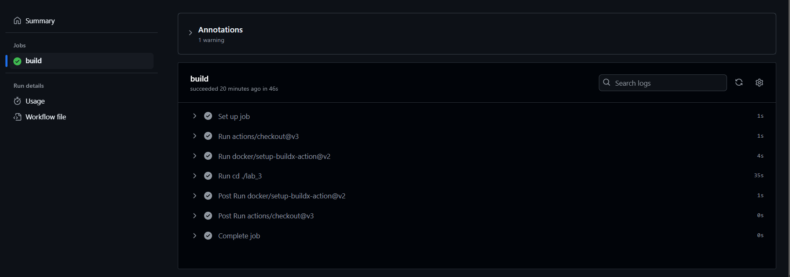
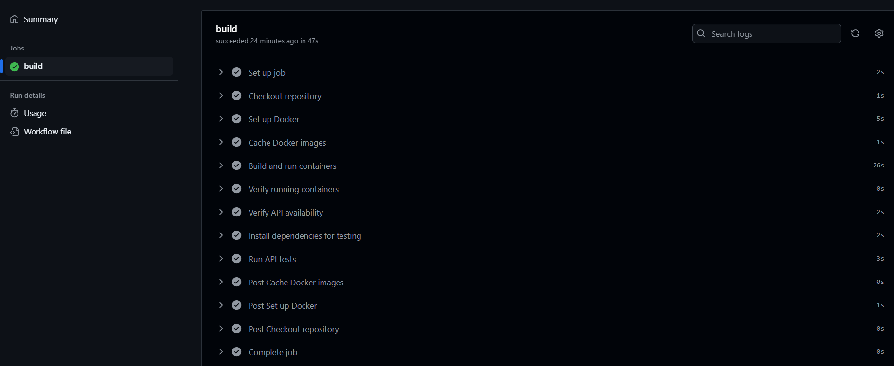

# Отчет по лабораторной работе №3

## Плохой CI/CD файл
```yaml
name: CI/CD for API

on:
  push:

jobs:
  build:
    runs-on: ubuntu-latest

    steps:
      - uses: actions/checkout@v3
      - uses: docker/setup-buildx-action@v2
      - run: |
          cd ./lab_3
          docker compose up -d --build
```

Какой-то маленький и скучный файлик, явно плохой, давайте напишем хороший CI/CD и посмотрим чем же он лучше.

## Хороший CI/CD файл
```yaml
name: CI/CD for API

on:
  push:
    branches:
      - main # Указываем конкретные ветки при пуше в которые надо запускать pipeline

jobs:
  build:
    runs-on: ubuntu-22.04 # Указываем конкретную версию

    steps:
      - name: Checkout repository # Прописывание названий шагов для понятности
        uses: actions/checkout@v3

      - name: Set up Docker
        uses: docker/setup-buildx-action@v2

      - name: Cache Docker images # Кэширование образов
        uses: actions/cache@v3
        with:
          path: /tmp/.buildx-cache
          key: ${{ runner.os }}-buildx
          restore-keys: |
            ${{ runner.os }}-buildx

      - name: Build and run containers
        run: |
          docker compose -f ./lab_3/docker-compose.yml up -d --build

      - name: Verify running containers
        run: |
          docker ps

      - name: Verify API availability # Проверка доступности API
        # Тут усыпил на 2 секунды, чтобы контейнер успел подняться
        run: |
          sleep 2 
          curl -f http://localhost:8000/api/hash_code?s=test || exit 1

      - name: Install dependencies for testing
        run: |
          pip install pytest httpx

      - name: Run API tests
        run: |
          sleep 2
          pytest ./lab_3/tests.py --verbose
```

Вот это уже совсем другое дело, давайте опишем хорошие практики.

* ```yaml
  branches:
   -main
  ```
  Указываем конкретную ветку, обозначаем когда будет запускаться CI/CD файл. Плохо запускать его при изменениях в любой ветке, это как минимум съедает много ресурсов.
* ```yaml
  build:
    runs-on: ubuntu-22.04
  ```
  Указываем конкретную версию Ubuntu. Думаю по предыдущим лабораторным работам понятно чем череват latest.
* ```yaml
  - name: ...
  ```
  Использование name помогает улучшить читаемость и сделать анализ ошибок более легким
* ```yaml
  - name: Cache Docker images
    uses: actions/cache@v3
  ```
  Кэширование образов значительно ускоряет сборку контейнера на других этапах, позволяя им, например, скипнуть установку зависимостей. Особенно полезно если есть несколько jobs.
* ```yaml
  - name: Verify running containers
    ...
  - name: Verify API availability
    ...
  ```
  Проверка работы контейнеров и доступности API, позволяет сразу протестировать какие-нибудь ваши микросервисы на доступность (корректно ли запустились) и если нет, то прервать pipeline заранее.

## Скриншоты работы


Работа плохого CI/CD


Работа хорошего CI/CD

